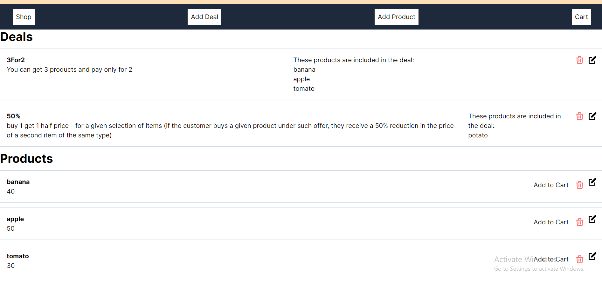

# Groceries Shop

This is a web application that allows an user to manage an online grocery shop. User can add, edit and delete products/deals. Products can be added to the cart and total sum of the products can be calculated.

## Technologies
Next JS and MongoDB

## Functionalities
- CRUD operations for products
- CRUD operations for deals
- Calculate total sum of the cart.

## Steps to run project locally
* Clone the repo
* Make sure you have an environment for running Node.js
* Write command 'npm install' to install all needed packages
* Run the project with `npm run dev`
* Your application is running on `localhost:3000`

##Images

